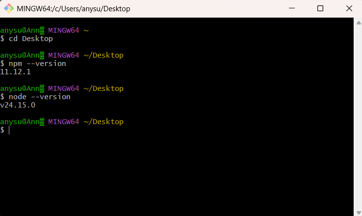
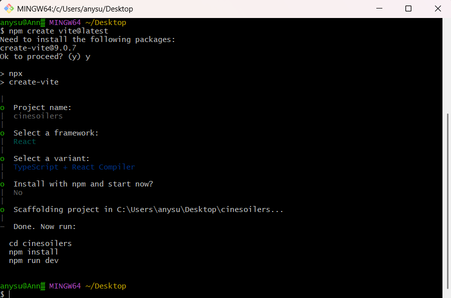
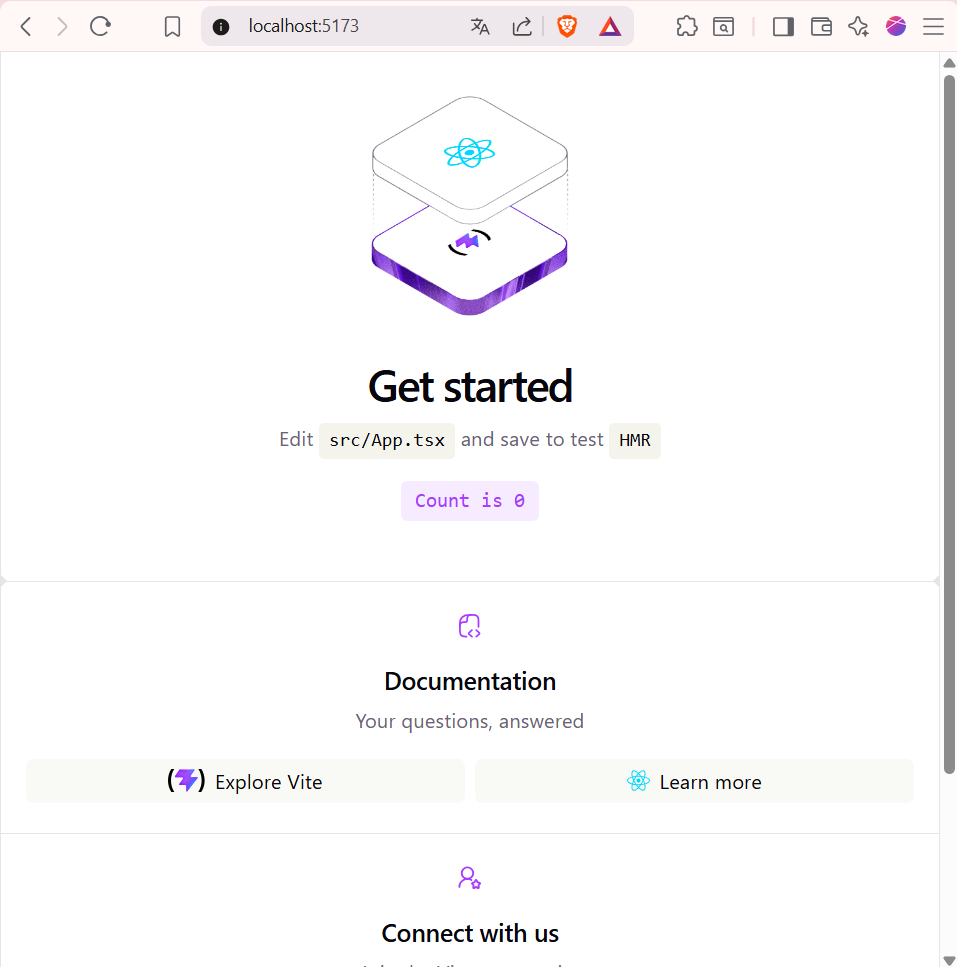
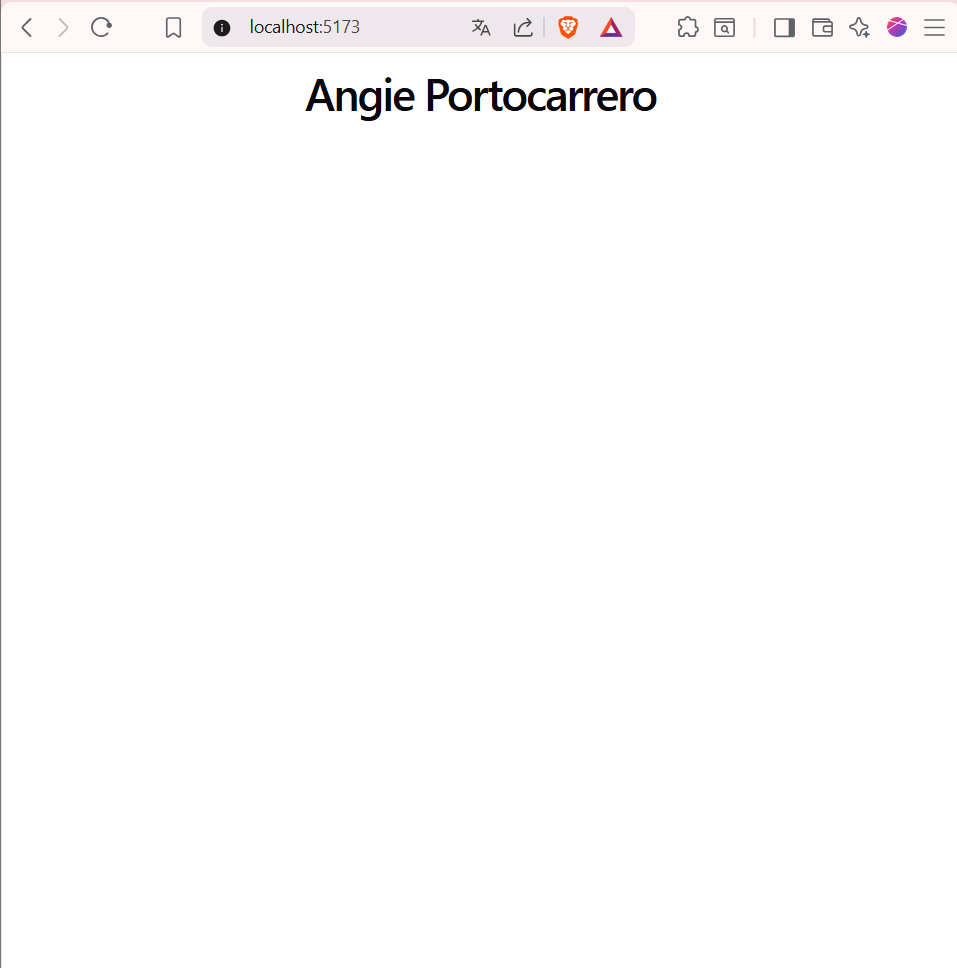
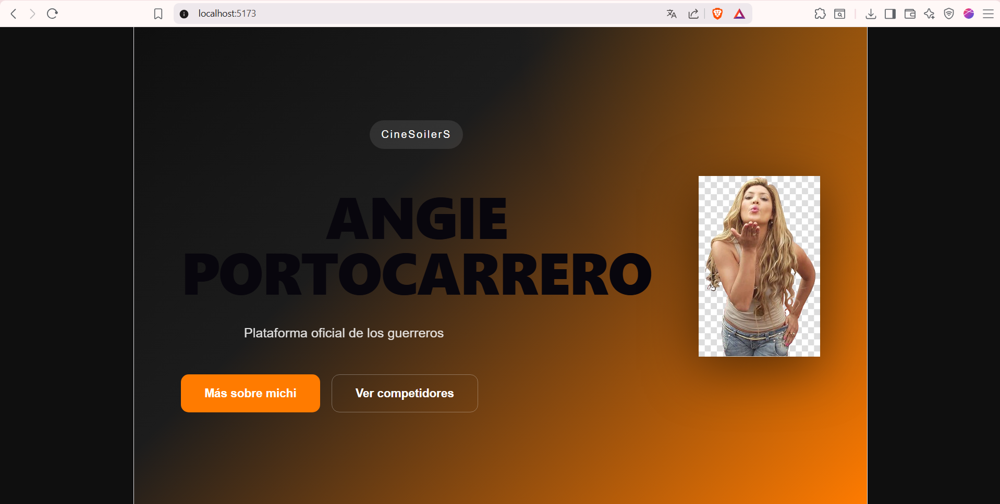

# 🎬✨ CineSoilerS ✨🎬

<div align="center">

## 🌟 Mi primer proyecto con React + Vite + TypeScript 🌟

Frontend moderno inspirado en una experiencia cinematográfica.

</div>

---

# 🚀 Tecnologías utilizadas

* ⚛️ React
* ⚡ Vite
* 📘 TypeScript
* 🎨 CSS3
* 🌐 Node.js
* 💻 Visual Studio Code

---

# 🧩 Desarrollo del proyecto

# ✅ Paso 1 — Verificar instalación de Node.js y npm

Antes de comenzar el proyecto se verificó que Node.js y npm estuvieran correctamente instalados.

### Comandos utilizados

```bash id="9m2vwx"
node -v
npm -v
```

📌 Esto permite ejecutar proyectos React y administrar dependencias correctamente.

---

## 📸 Evidencia


```

---

# ✅ Paso 2 — Crear el proyecto React con Vite

Se creó el proyecto utilizando Vite + React + TypeScript.

### Comando utilizado

```bash id="7wqj0n"
npm create vite@latest
```

### Configuración seleccionada

```txt id="bn3f4v"
Project name: cinesoilers
Framework: React
Variant: TypeScript
```

📌 Vite permite desarrollar aplicaciones modernas de forma rápida y optimizada.

---

## 📸 Evidencia

```md id="mv1y2r"

```

---

# ✅ Paso 3 — Ejecutar el proyecto

Después de instalar las dependencias se ejecutó el servidor de desarrollo.

### Instalación de dependencias

```bash id="r0c7ja"
npm install
```

### Ejecutar proyecto

```bash id="6xg4pt"
npm run dev
```

📌 La aplicación se ejecutó correctamente en:

```txt id="9c5s8d"
http://localhost:5173
```

---

## 📸 Evidencia

```md id="x2l9uw"

```

---

# ✅ Paso 4 — Personalización inicial de la vista

Se modificó el archivo `App.tsx` para personalizar la interfaz con mi nombre y mi rol como Frontend Developer.

### Cambios realizados

* Hero Section
* Botones personalizados
* Fondo cinematográfico
* Diseño moderno responsive

📌 También se trabajó con:

* Flexbox
* CSS moderno
* React Components

---

## 📸 Evidencia

```md id="v8a6hk"

```

---

# ✅ Paso 5 — Vista final del proyecto

Finalmente se obtuvo una interfaz moderna inspirada en plataformas cinematográficas.

### Características finales

✅ Diseño fullscreen
✅ Fondo cinematográfico
✅ Hero Section moderna
✅ Imagen personalizada
✅ Botones interactivos
✅ Responsive Design

---

## 📸 Evidencia

```md id="d4n1ry"

```

---

# 📂 Estructura del proyecto

```txt id="w9u6mz"
cinesoilers/
│
├── src/
│   ├── images/
│   │   ├── 1.png
│   │   ├── 2.png
│   │   ├── 3.png
│   │   ├── 4.png
│   │   ├── 5.png
│   │   └── angie.png
│   │
│   ├── App.tsx
│   ├── App.css
│   ├── main.tsx
│   └── index.css
│
├── package.json
└── README.md
```

---

# 💻 Ejecutar el proyecto localmente

```bash id="r8j4vo"
git clone <repo-url>

cd cinesoilers

npm install

npm run dev
```

---

<div align="center">

# 🎬 CineSoilerS 🎬

✨ Desarrollado por Angie Portocarrero ✨

</div>
